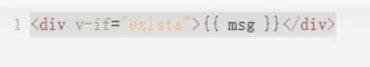
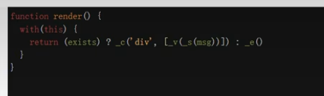
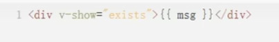
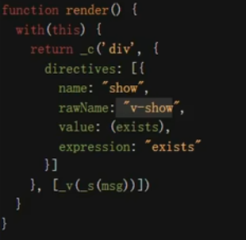
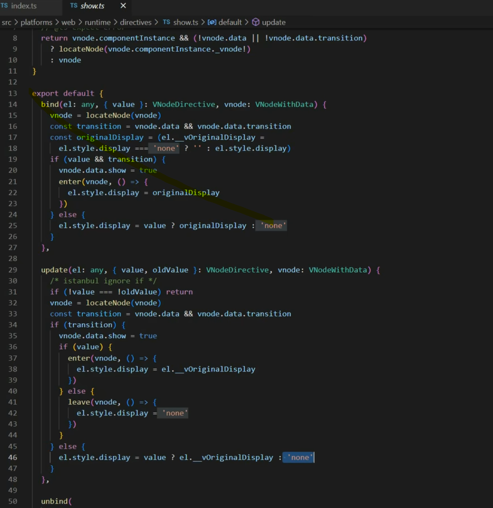

## v-if 和 v-show 怎么理解

1. 基本概念

- v-if 如果条件不成立 则不会渲染当前指令所在节点的 dom 元素
- v-show 切换当前 dom 显示与隐藏 通过样式控制

2. 效果

   - v-if vue2 编译
     
     

   - v-show vue2 编译
     
     

     ::: tip 注意
     v-show 内置指令 源码

     绑定时会先缓存 dom 的 display 属性值，条件满足时会 赋予原始属性值，不满足时赋予 none
     
     :::

3. 如何选择？

- v-if 会阻断内部代码执行，如果不成立 就不会执行 内部逻辑
- 不会频繁更新的 就是用 v-if

## v-if 和 v-show 的优先级 哪个更高？

`v-if和v-show避免在同一个标签中使用。如果遇到需要同时 使用时，可以使用 结算属性的方式`

::: warning 避免这种写法

```html
<li v-for="i in arr" v-if="false"></li>
```

:::

- 在 vue2 解析时，v-for 优先级比 v-if 高，先解析 v-for 再解析 v-if。会导致先循环再对每一项进行判断，浪费性能。

- vue3 中 v-if 比 v-for 优先级高

> 可以同时使用 v-if 与 v-for vue3 会把 v-if 创建并提取到外层 template 节点上

## 虚拟dom

面试题:阐述一下你对vue中虚拟dom的理解.

### 什么是虚拟dom?

> 虚拟dom本质上是一个普通的js对象,用于描述视图的界面结构.
> 在vue中,每个组件都有一个render函数,每个render函数都会返回一个虚拟dom树,这就意味着每个组件都对应一颗虚拟dom树.

### 为什么需要虚拟dom?

> 在vue 中，渲染视图会调用rener 函数，这种染不仅发生在组件创建时，同时发生> 在视图依赖的数据更新时。如果在渲染时，直接使用真实 DOM，由于真实 DOM 的创> 建、更新、插入等操作会带来大量的性能损耗，从而就会极大的降低渲染效率。
> 因此，vue 在渲染时，使用虚拟dom来替代真实dom，主要为解决渲染效率的问题.

### 虚拟dom如何转换为真实dom的?

> 在一个组件实例首次被渲染时，它先生成虚拟dom树，然后根据虚拟dom树创建真实dom，并把真实dom挂载到页面中合适的位置，此时，每个虚拟dom便会对应一个真实的dom。
> 如果一个组件受响应式数据变化的影响，需要重新渲染时，它仍然会重新调用render函数，创建出一个新的虚拟dom树，用新树和旧树对比，通过对比，vue会找到最小更新量，然后更新必要的虚拟dom节点，最后这些更新过的虚拟节点，会去修改它们对应的真实dom.
> 这样一来，就保证了对真实dom达到最小的改动。

### 模板和虚拟dom的关系

> vue框架中有一个compile 模块,它主要负责将模板转换为 render 函数，而render 函数调用后将得到虚拟dom
> 编译的过程分两步:
> 1.将模板字符串转换成为AST
> 2.将AST转换为 render函数
> 如果使用传统的引入方式，则编译时间发生在组件第一次加载时，这称之为运行时编译。
> 如果是在vue-cl1的默认配置下，编译发生在打包时，这称之为模板预编译。
> 编译是一个极其耗费性能的操作，预编译可以有效的提高运行时的性能，而且，由于运行的时候已不需要编译，vue-cli在打包时会排除掉vue中的compile模块，以减少打包体积模板的存在，仅仅是为了让开发人员更加方便的书写界面代码
> vue最终运行的时候，最终需要的是render函数，而不是模板，因此，模板中的各种语法，在虚拟dom中都是不存在的，它们都会变成虚拟dom的配置.
