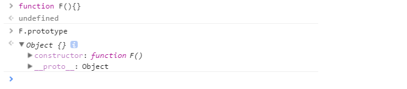
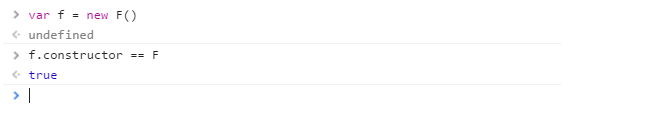

# 判断数据类型方法

> 基本类型：String、Number、Boolean、Symbol、Undefined、Null 
> 引用类型：Object

基本类型也称为简单类型，由于其占据空间固定，是简单的数据段，为了便于提升变量查询速度，将其存储在栈中，即按值访问。

引用类型也称为复杂类型，由于其值的大小会改变，所以不能将其存放在栈中，否则会降低变量查询速度，因此，其值存储在堆(heap)中，而存储在变量处的值，是一个指针，指向存储对象的内存处，即按址访问。引用类型除 Object 外，还包括 Function 、Array、RegExp、Date 等等。

### 1. typeof

typeof 是一个操作符，其右侧跟一个一元表达式，并返回这个表达式的数据类型。返回的结果用该类型的字符串(全小写字母)形式表示，包括以下 7 种：number、boolean、symbol、string、object、undefined、function 等。

```javascript
typeof '' // string 有效
typeof 1 // number 有效
typeof Symbol() // symbol 有效
typeof true //boolean 有效
typeof undefined //undefined 有效
typeof null //object 无效
typeof [] //object 无效
typeof new Function() // function 有效
typeof new Date() //object 无效
typeof new RegExp() //object 无效
```

- 对于基本类型，除 null 以外，均可以返回正确的结果。
- 对于引用类型，除 function 以外，一律返回 object 类型。
- 对于 null ，返回 object 类型。
- 对于 function 返回  function 类型。

其中，null 有属于自己的数据类型 Null ， 引用类型中的 数组、日期、正则 也都有属于自己的具体类型，而 typeof 对于这些类型的处理，只返回了处于其原型链最顶端的 Object 类型

### 2. instanceof
instanceof 是用来判断 A 是否为 B 的实例，表达式为：A instanceof B，如果 A 是 B 的实例，则返回 true,否则返回 false。

```js
[] instanceof Array; // true
{} instanceof Object;// true
new Date() instanceof Date;// true
 
function Person(){};
new Person() instanceof Person;
 
[] instanceof Object; // true
new Date() instanceof Object;// true
new Person instanceof Object;// true
```

instanceof  操作符的问题在于，它假定只有一个全局执行环境。如果网页中包含多个框架，那实际上就存在两个以上不同的全局执行环境，从而存在两个以上不同版本的构造函数。如果你从一个框架向另一个框架传入一个数组，那么传入的数组与在第二个框架中原生创建的数组分别具有各自不同的构造函数。

```js
var iframe = document.createElement('iframe')
document.body.appendChild(iframe)
xArray = window.frames[0].Array
var arr = new xArray(1, 2, 3) // [1,2,3]
arr instanceof Array // false
```

针对数组的这个问题，ES5  提供了  Array.isArray()  方法 。该方法用以确认某个对象本身是否为 Array 类型，而不区分该对象在哪个环境中创建。

```js
if (Array.isArray(value)) {
  //对数组执行某些操作
}
```

Array.isArray() 本质上检测的是对象的 [[Class]] 值，[[Class]] 是对象的一个内部属性，里面包含了对象的类型信息，其格式为 [object Xxx] ，Xxx 就是对应的具体类型 。对于数组而言，[[Class]] 的值就是 [object Array] 。

### 3.constructor

当一个函数 F 被定义时，JS 引擎会为 F 添加 prototype 原型，然后再在 prototype 上添加一个 constructor 属性，并让其指向 F 的引用。如下所示：

当执行 var f = new F() 时，F 被当成了构造函数，f 是 F 的实例对象，此时 F 原型上的 constructor 传递到了 f 上，因此 f.constructor == F


##### 细节问题

> 1.  null 和 undefined 是无效的对象，因此是不会有 constructor 存在的，这两种类型的数据需要通过其他方式来判断。
> 2.  函数的 constructor 是不稳定的，这个主要体现在自定义对象上，当开发者重写 prototype 后，原有的 constructor 引用会丢失，constructor 会默认为 Object

### 4. toString
toString() 是 Object 的原型方法，调用该方法，默认返回当前对象的 [[Class]] 。这是一个内部属性，其格式为 [object Xxx] ，其中 Xxx 就是对象的类型。
对于 Object 对象，直接调用 toString()  就能返回 [object Object] 。而对于其他对象，则需要通过 call / apply 来调用才能返回正确的类型信息。

```js
Object.prototype.toString.call('') // [object String]
Object.prototype.toString.call(1) // [object Number]
Object.prototype.toString.call(true) // [object Boolean]
Object.prototype.toString.call(Symbol()) //[object Symbol]
Object.prototype.toString.call(undefined) // [object Undefined]
Object.prototype.toString.call(null) // [object Null]
Object.prototype.toString.call(new Function()) // [object Function]
Object.prototype.toString.call(new Date()) // [object Date]
Object.prototype.toString.call([]) // [object Array]
Object.prototype.toString.call(new RegExp()) // [object RegExp]
Object.prototype.toString.call(new Error()) // [object Error]
Object.prototype.toString.call(document) // [object HTMLDocument]
Object.prototype.toString.call(window) //[object global] window 是全局对象 global 的引用
```
